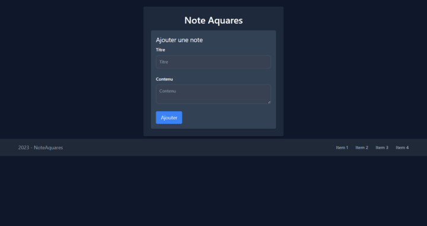
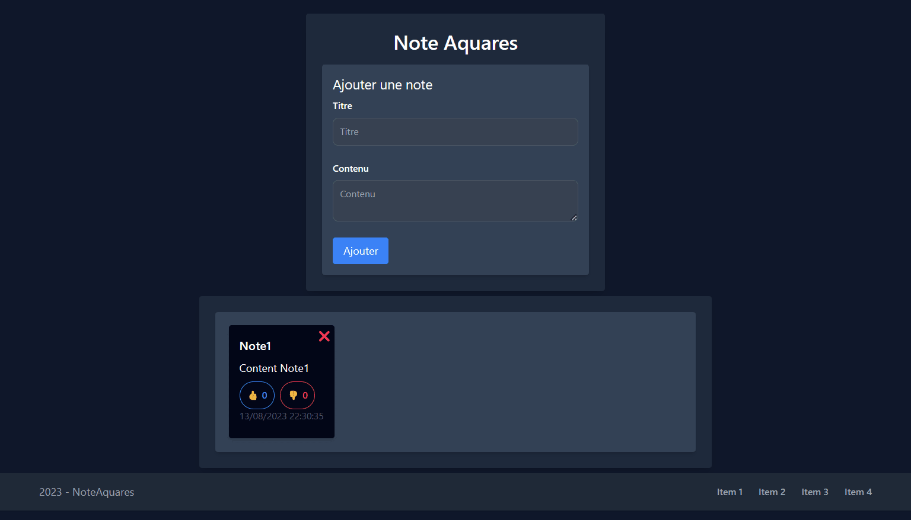

# NoteAquares

## Présentation

L'Application NoteAquares est une application web simple qui permet aux utilisateurs de créer, gérer et organiser leurs notes. Les utilisateurs peuvent ajouter des notes avec un titre, du contenu, une date et même indiquer leur appréciation avec un bouton "Like" et "Dislike" et "Delete".

## Prévisualisation

## Installation
1. Clonez ce référentiel sur votre machine locale.
2. Ouvrez un terminal et naviguez jusqu'au répertoire du projet.
3. Exécutez la commande `npm install` pour installer les dépendances.
4. Exécutez la commande `npm run dev` pour démarrer l'application en mode de développement.

## Utilisation
1. Ouvrez l'application en accédant à l'URL (`http://127.0.0.1:5173/`) fournie par la commande `npm run dev`.
2. Sur la page principale, vous pouvez voir la liste de toutes vos notes existantes.
3. Cliquez sur le bouton "Ajouter une Note" pour créer une nouvelle note.
4. Remplissez le titre, le contenu et la date de la note.
5. Cliquez sur le bouton "Enregistrer" pour ajouter la note.
6. Vous pouvez également cliquer sur le bouton "J'aime" pour montrer que vous aimez une note.

## Technologies Utilisées
- [Vite.js](https://vitejs.dev/): Vite est un outil de construction rapide pour les applications web modernes. Il offre un temps de démarrage incroyablement rapide en utilisant la compilation à la volée (on-the-fly) pour les modules ES6.
- [React](https://reactjs.org/): React est une bibliothèque JavaScript open-source utilisée pour la construction d'interfaces utilisateur. Il permet de créer des composants réutilisables et de gérer facilement l'état de l'application.
- [Tailwind CSS](https://tailwindcss.com/): Tailwind CSS est un framework CSS utilitaire qui permet de créer des interfaces rapidement en combinant des classes utilitaires. Il favorise un développement rapide et la personnalisation via les classes CSS directement dans le code HTML.

## Licence
Ce projet est publié sous la licence MIT. Pour plus d'informations, consultez le fichier LICENSE.

## Crédits

L'icône `/public/note_logo.icon` utilisée dans cette application a été créée par
[icongeek26](https://www.flaticon.com/fr/auteurs/icongeek26) ([https://www.flaticon.com/fr/auteurs/icongeek26](https://www.flaticon.com/fr/auteurs/icongeek26))
et est disponible sur Flaticon sous la licence suivante :
<a href="https://www.flaticon.com/fr/icones-gratuites/commande" title="commande icônes">Commande icônes créées par Icongeek26 - Flaticon</a>